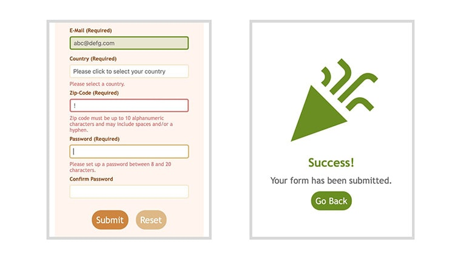

# js-form-validation

## The Odin Project: Form Validation with JavaScript

<a href="https://kbelltree.github.io/js-form-validation/">

</a>

This browser-based form was developed to demonstrate understanding of form validation using JavaScript. For more details on this project, please refer to the lesson ["Form Validation with JavaScript"](https://www.theodinproject.com/lessons/node-path-javascript-form-validation-with-javascript) on The Odin Project.

## Key Project Instructions

- **Form Fields:**   The form should include the following input fields:

  - Email
  - Country
  - Zip Code
  - Password
  - Password Confirmation

- **Inline Validation:** Implement live inline validation and style the fields to indicate validation status.

- **JavaScript Validation:** Use JavaScript exclusively for validating all input fields.

- **Submit Action:** The submit button should demonstrate functionality but does not need to perform actual form submission.

- **Error Messages:** Display error messages upon submission if there are any empty fields or invalid entries.

- **Success Message:** Congratulate the user upon successful form validation.

## Built With

- **HTML** - Structure of the web form.
- **CSS** - Styling of the web form.
- **JavaScript** - Functionality for form validation.
- **ESLint** - Linting JavaScript code to improve quality and consistency.
- **Prettier** - Code formatter to maintain consistent style.

---

### Resources Used

Brainstorming Tool by [Miro](https://miro.com)

List of all countries with their 2 digit codes(ISO 3166-1) by [Data Hub](https://datahub.io/core/country-list)

HTML Country Select Dropdown List by [Dan Rovito](https://gist.github.com/danrovito/977bcb97c9c2dfd3398a)

Success and Error Flash Message by [Natasha Girish on Dribble](https://dribbble.com/shots/21907596-Success-and-Error-Flash-Message-DailyUI-Challenge-011)

HTML Color Names by [W3Schools](https://www.w3schools.com/tags/ref_colornames.asp)

Material Design Icons by [Pictogrammers](https://pictogrammers.com/library/mdi/)

Searching Tool by [ChatGPT4](https://chatgpt.com)

### Referenced Tutorials

JavaScript Related:

- [The Complete Guide to HTML Forms and Constraint Validation by sitepoint](https://www.sitepoint.com/html-forms-constraint-validation-complete-guide/)

- [ValidityState: valueMissing property by MDN Web Docs](https://developer.mozilla.org/en-US/docs/Web/API/ValidityState/valueMissing)

- [oninput Event by W3Schools](https://www.w3schools.com/jsref/event_oninput.asp)

- [onblur Event by W3Schools](https://www.w3schools.com/jsref/event_onblur.asp)

- [Sending form data by MDN Web Docs](https://developer.mozilla.org/en-US/docs/Learn/Forms/Sending_and_retrieving_form_data)

HTML Related:

- [&lt;input type="password"&gt; by MDN Web Docs](https://developer.mozilla.org/en-US/docs/Web/HTML/Element/input/password)

- [Email Validation Rules: Mastering Email Address Syntax by EmailListValidation](https://emaillistvalidation.com/blog/email-validation-rules-mastering-email-address-syntax/)

- [What is the ultimate postal code and zip regex? by stack overflow](https://stackoverflow.com/questions/578406/what-is-the-ultimate-postal-code-and-zip-regex)

CSS Related:

- [A good reset by Trys Mudford](https://www.trysmudford.com/blog/a-good-reset/)

- [Update 2023-09-22: Using :user-invalid in Form Validation: You want :not(:focus):not(:placeholder-shown):invalid, not :invalid by Bram.us](https://www.bram.us/2021/01/28/form-validation-you-want-notfocusinvalid-not-invalid/#v5)
